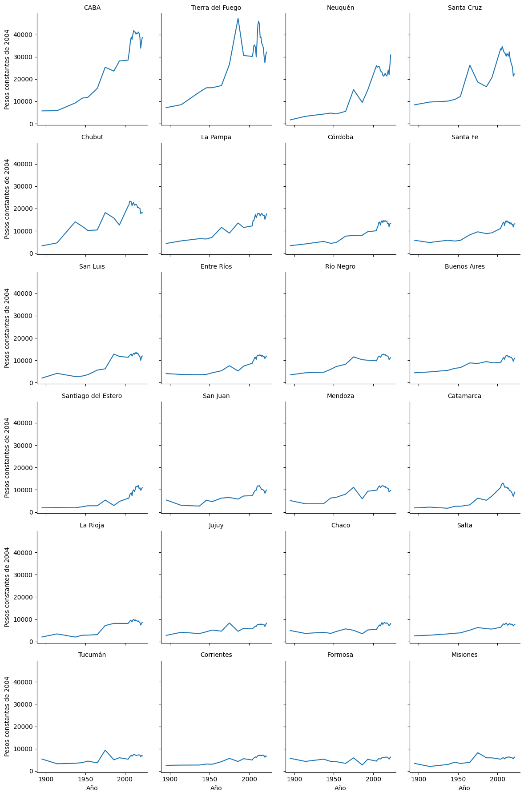

# El producto bruto de las provincias argentinas en el largo plazo. 

Este repositorio contiene el codigo y bases de datos utilizadas para el armado 
de una serie de tiempo de largo plazo (1895 a la actualidad) del producto bruto
geográfico de Argentina. 


## Fuentes de información


*   **Araoz et al (2020). Growth and convergence among Argentine provinces since 1895 en Tirado Fabregat et al (Ed.), _Time and Space: Latin American Regional Development in Historical Perspective_ (Palgrave Studies in Economic History, pp. 65-95). Palgrave Macmillan. https://doi.org/10.1007/978-3-030-47553-6**. Contiene información sobre la participación de cada provincia en el PIB nacional, para los años 1895,1914,1937,1946,1953,1965,1975,1986,1993 y 2004. Datos extraídos de la Tabla 4.1. 

*   **Equipo de trabajo de la CEPAL y el Ministerio de Economía de la Argentina, [_Desagregación provincial del valor agregado bruto de la Argentina, base 2004_](https://www.cepal.org/es/publicaciones/47900-desagregacion-provincial-valor-agregado-bruto-la-argentina-base-2004), Documentos de Proyectos (LC/TS.2022/196; LC/BUE/TS.2022/9),Santiago, Comisión Económica para América Latina y el Caribe (CEPAL), 2022.** Contiene el Valor Agregado Bruto (VAB) a precios básicos por provincias entre los años 2004-2022. Datos extraídos del [anexo estadístico](https://repositorio.cepal.org/bitstreams/7399c6c9-0827-42da-b433-d176cb4107c7/download) 

*   **Ferreres, Orlando (2005). [Cuentas nacionales](https://dossiglos.fundacionnorteysur.org.ar/series/cuentas-nacionales) en _Dos siglos de economía argentina (1810 - 2004): historia argentina en cifras_. Fundación Norte y Sur.**. El capítulo contiene un amplio anexo estadístico el cual ha tenido ya varias actualizaciones. De la base de datos [Cuentas Nacionales](https://docs.google.com/spreadsheets/d/e/2PACX-1vTAGGfIqDw18YDI5zasGBRa4sG1ddUfMcKT87fzTkvz8HMe8Ipl6zJU0M2788oZrw/pub?output=xls) se extrajeron los datos correspondientes al PIB nacional a precios de mercado de 2004 entre los años 1809-2018

*   **Ferreres, Orlando (2005). [Provincias](https://dossiglos.fundacionnorteysur.org.ar/series/provincias) en _Dos siglos de economía argentina (1810 - 2004): historia argentina en cifras_. Fundación Norte y Sur.**. El capítulo contiene un amplio anexo estadístico el cual ha tenido ya varias actualizaciones. De la base de datos [Provincias - Serie 1](https://docs.google.com/spreadsheets/d/e/2PACX-1vTp7K9ixEWzesZybHJG_e47YfafF49L8dqgtLgqItT45Gb4Ru0YjIF0723lxCHRhA/pub?output=xls) se extrajeron los datos correspondientes a la población por provincia entre los años 1869-2018

*   **Instituto Nacional de Estadísticas y Censos (2013). [Población estimada al 1 de julio según año calendario por sexo para el total del país y provincias. Años 2010-2040](https://www.indec.gob.ar/ftp/cuadros/poblacion/c1_proyecciones_prov_2010_2040.xls) en _Proyecciones provinciales de población por sexo y grupo de edad 2010-2014_. Ciudad Autónoma de Buenos Aires. INDEC.** Se extrajeron de aquí la proyección de la población por provincia, año y sexo. 


## Metodología

La metolodía consistió en el armado de tres series de tiempo de largo plazo (1895 a la actualidad): 
*   Valor Agregado Bruto (VAB) a precios básicos de 2004 por provincia
*   Población por provincia
*   VAB per cápita a precios básicos de 2004 por provincia. La cual resulta de realizar un cociente por año y provincia de los indicadores anteriores. 

A continuación se detalla la metodología de calculo empleada en los primeros dos casos

### Valor Agregado Bruto (VAB) a precios básicos de 2004 por provincia

En la siguiente tabla se detalla la metodología 

| Variable 	| Unidad de Medida 	| Años 	| Metodología 	|  	
|---	|---	|---	|---	|
| PIB a precios de mercado por provincia (PIBpm) 	| pesos constantes de 2004 	| 1895-2004 	| Tomando la participación de cada provincia en el PIB nacional <br>estimado en Aráoz et al (2020), y el valor del PIB a precios de mercado proveniente de Ferreres (2005), se calcula el PIB a precios de mercado por provincia 	|  	
| VAB a precios básicos (VABpb) por provincia 	| pesos constantes de 2004 	| 2004-2022 	| Se toma el dato directamente de CEPAL que está desagregado por año, provincia y sector de la actividad económica y se realiza una agregación sumando el todos los sectores para cada año y provincia, para obtener el VABpb total por provincia y año	|  	
| VAB a precios básicos (VABpb) por provincia 	| pesos constantes de 2004 	| 1895-2022 	| Para los años 2004-2022 se toma el VABpb de CEPAL. Para los años 1895-2003 se estima el VABpb haciendo el empalme hacia atrás: utilizando el valor del PIBpm de Ferreres y el cociente VABpb (CEPAL) / PIBpm (Ferreres) en 2004 para replicar esa misma relación |


Para ver en detalle cómo se ha hecho la limpieza y el procesamiento de las bases de datos, asi como también el calculo implmentado puede ver el código de los archivos `src/fuentes.py` y `src/procesamiento.py`

### Población por provincia

En la siguiente tabla se detalla la metodología 

| Variable 	| Unidad de Medida 	| Años 	| Metodología 	|  	
|---	|---	|---	|---	|
| Población por provincia 	| habitantes 	| 1895-2018 	| Se toma el dato directamente de Ferreres  	|  	
| Población por provincia 	| habitantes 	| 2010-2040	| Se toma el dato directamente de INDEC 	|  	
| Población por provincia 	| habitantes 	| 1895-2040 	| Para los años 2010-2022 se toma el dato de INDEC. Para los años 1895-2009 se estima haciendo el empalme hacia atrás: utilizando el valor del población de Ferreres y el cociente población (INDEC) / población (Ferreres) en 2010 para replicar esa misma relación |


Para ver en detalle cómo se ha hecho la limpieza y el procesamiento de las bases de datos, asi como también el calculo implmentado puede ver el código de los archivos `src/fuentes.py` y `src/procesamiento.py`

## Datos Abiertos

En la carpeta `'./tablas'` se pueden encontrar todas las tablas pre-procesadas que se utilizaron para realizar los empalmes de las series de tiempo de VABpb y de Población. 

### [clean_araoz.csv](https://github.com/datos-Fundar/valor-agregado-bruto-largo-plazo-argentina/blob/main/tablas/clean_araoz.csv)

|**Variable**|**Tipo de dato**|**Descripcion**|
|:-------------:|:-------------:|:-------------:|
| provincia | alfanumérico | Provincia de Argentina |
| anio | entero | Año |
| share_gdp | real | Participación del VAB provincial en el total nacional, en %  |

### [clean_cepal.csv](https://github.com/datos-Fundar/valor-agregado-bruto-largo-plazo-argentina/blob/main/tablas/clean_cepal.csv)

|**Variable**|**Tipo de dato**|**Descripcion**|
|:-------------:|:-------------:|:-------------:|
| sector_de_actividad_económica | alfanumérico | Sector de la actividad Económica |
| anio | entero | Año |
| vab_pb | real | VAB provincial a precios básicos en pesos constantes de 2004  |
| provincia | alfanumérico | Provincia de Argentina |

### [clean_fnys_pob.csv](https://github.com/datos-Fundar/valor-agregado-bruto-largo-plazo-argentina/blob/main/tablas/clean_fnys_pob.csv)

|**Variable**|**Tipo de dato**|**Descripcion**|
|:-------------:|:-------------:|:-------------:|
| provincia | alfanumérico | Provincia de Argentina |
| anio | entero | Año |
| poblacion | real | Cantidad de habitantes estimados  |

### [clean_fnys_prod.csv](https://github.com/datos-Fundar/valor-agregado-bruto-largo-plazo-argentina/blob/main/tablas/clean_fnys_prod.csv)

|**Variable**|**Tipo de dato**|**Descripcion**|
|:-------------:|:-------------:|:-------------:|
| anio | entero | Año |
| pib_pm | real | PBI a precios de mercado en pesos constantes de 2004  |

### [clean_indec.csv](https://github.com/datos-Fundar/valor-agregado-bruto-largo-plazo-argentina/blob/main/tablas/clean_indec.csv)

|**Variable**|**Tipo de dato**|**Descripcion**|
|:-------------:|:-------------:|:-------------:|
| anio | entero | Año |
| pob_total | real | Cantidad de habitantes estimados  |
| pob_varones | real | Cantidad de habitantes varones estimados  |
| pob_mujeres | real | Cantidad de habitantes varones estimados  |
| provincia | alfanumérico | Provincia de Argentina |

### [empalme_series_pbg_pob_vab_pc.csv.csv](https://github.com/datos-Fundar/valor-agregado-bruto-largo-plazo-argentina/blob/main/tablas/empalme_series_pbg_pob_vab_pc.csv)

|**Variable**|**Tipo de dato**|**Descripcion**|
|:-------------:|:-------------:|:-------------:|
| provincia | alfanumérico | Provincia de Argentina |
| anio | entero | Año |
| vab_pb | real | VAB provincial a precios básicos en pesos constantes de 2004  |
| pob_total | real | Cantidad de habitantes estimados  |
| vab_pb_per_capita | real | VAB per cápita a precios básicos en pesos constantes de 2004  |


## Código 

### Instalación 

```
pip install -r requirements.txt
```

### Linea de comandos

```
python run.py  # genera empalme y guarda en la carpeta "./tablas"
python run.py --generar-tablas # guarda las tablas limpias en la carpeta "./tablas/"

```

### Notebook 


```python

import seaborn as sns
from run import main, PATHS

empalme_df = main(**PATHS)

# VABpb per capita por provincia 
to_plot = empalme_df.query(expr="provincia != 'No distribuido'") # Solo hay datos entre 2004-2022
anio_max = to_plot.anio.max()
col_ord = to_plot[to_plot.anio==anio_max].sort_values(by='vab_pb_per_capita',ascending=False)['provincia'].to_list()
g =sns.FacetGrid(to_plot, col='provincia', col_wrap=4, col_order=col_ord)
g.map_dataframe(sns.lineplot, x='anio', y='vab_pb_per_capita')
g.set_axis_labels(x_var = "Año", y_var= "Pesos constantes de 2004" )
g.set_titles(col_template="{col_name}")
g.tight_layout()

```
